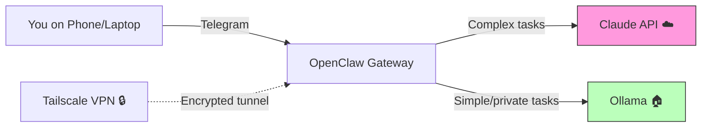

# OpenClaw AI Hub

> ## ⚠️ Archived — superseded (October 2026)
>
> This guide is **no longer maintained**. The setup it describes was retired in July 2026 and replaced by a
> multi-node Claude Code fleet. The current, maintained material lives in
> **[ai-fleet-blueprint](https://github.com/kirchbergcapitalservices/ai-fleet-blueprint)** — same author,
> same production lessons, different architecture.
>
> **One recommendation in this guide is withdrawn:** `docs/SETUP.md` tells you to create a *dedicated
> throw-away e-mail address* and register a *separate Anthropic API account with its own payment method*
> on it. In practice the mail provider closed the bot-only address within a day; the API account and the
> card attached to it then lived on with no login path left. **Do not do this.** Register API accounts on
> an address you control permanently, and treat an API key as something you must always be able to revoke.
>
> Everything else here is left as-is for reference. The repository is archived (read-only).

> Your personal AI assistant — self-hosted, secure, extensible.

**OpenClaw AI Hub** is a battle-tested setup guide and toolkit for running [OpenClaw](https://openclaw.ai) as a dedicated AI assistant on your own hardware. Combine local open-source models (Mistral, Qwen, Phi-4) with cloud AI (Claude) — controlled via Telegram, accessible from anywhere.

This guide is based on months of real-world production use on a dedicated Mac Mini.

## How It Works

This is a **hybrid setup**: your AI assistant runs on a dedicated Mac on your network, reachable via Telegram from anywhere through an encrypted Tailscale tunnel.



**Important — be honest about the data flow:**
- **Claude (cloud):** Your primary model for complex tasks. Requests are sent to Anthropic's API — data leaves your machine. Anthropic's [API data policy](https://www.anthropic.com/policies/privacy) states that API data is not used for training, and a DPA is available.
- **Ollama (local):** Models like Mistral 7B and Qwen 2.5 run 100% on your hardware. Data never leaves your machine. But these models are significantly less capable than Claude for complex reasoning, orchestration, and multi-step tasks.
- **Tailscale:** End-to-end encrypted mesh VPN. No traffic goes through Tailscale's servers.


## Features

- **Dedicated AI machine** — runs 24/7 on a Mac Mini (or similar hardware)
- **Telegram interface** — chat with your AI from anywhere
- **Local + Cloud models** — Ollama for privacy-sensitive tasks, Claude for heavy lifting
- **Tailscale VPN** — secure remote access without port forwarding
- **LaunchAgents** — reliable macOS-native task scheduling (not cron, not OpenClaw crons — [here's why](launchagents/README.md))
- **Security hardening** — guest WiFi isolation, firewall, FileVault, standard user account
- **Cost optimization** — model routing, heartbeat tuning, session hygiene
- **SOUL.md template** — personality, boundaries, and prompt injection defense

## Supported Models

| Model | Type | RAM | Strength | Use Case |
|-------|------|-----|----------|----------|
| Mistral Small 3.1 22B (Q4_K_M) | Local | ~16 GB | General purpose, tool use | Primary fallback, sub-agents |
| Qwen 2.5 3B | Local | ~2 GB | Lightweight routing | Cron jobs, heartbeat |
| Qwen 2.5 Coder 14B | Local | ~9 GB | Code generation | Dedicated coding sub-agent |
| Phi-4 14B | Local | ~9 GB | Reasoning | Analysis (no tool support!) |
| Claude Sonnet | Cloud | — | Orchestration, complex tasks | Primary conversation model |

> **RAM guide:** 16 GB minimum for one local model alongside OpenClaw. 24 GB recommended. 64 GB lets you run multiple large models simultaneously.

## Quick Start

### Prerequisites
- Mac Mini M1/M2/M4 (or comparable hardware with 16+ GB RAM)
- macOS 14+
- A Telegram account
- An Anthropic API key ([console.anthropic.com](https://console.anthropic.com))

### Installation

```bash
git clone https://github.com/kirchbergcapitalservices/openclaw-ai-hub.git
cd openclaw-ai-hub
chmod +x scripts/*.sh
./scripts/install.sh
```

The install script will:
1. Check prerequisites (Homebrew, Node.js)
2. Install Ollama and pull recommended models
3. Install OpenClaw
4. Guide you through the onboarding wizard

For the full step-by-step guide, see **[docs/SETUP.md](docs/SETUP.md)**.

## Documentation

| Doc | Description |
|-----|-------------|
| [SETUP.md](docs/SETUP.md) | Complete step-by-step installation guide |
| [SECURITY.md](docs/SECURITY.md) | macOS hardening, network isolation, account separation |
| [ARCHITECTURE.md](docs/ARCHITECTURE.md) | System architecture and data flow |
| [COST-OPTIMIZATION.md](docs/COST-OPTIMIZATION.md) | Model routing, heartbeat config, session hygiene |
| [TROUBLESHOOTING.md](docs/TROUBLESHOOTING.md) | Common problems and solutions |
| [MEMORY-MANAGEMENT.md](docs/MEMORY-MANAGEMENT.md) | Memory architecture, staleness prevention, multi-node sync |
| [OPERATIONAL-FRAMEWORK.md](docs/OPERATIONAL-FRAMEWORK.md) | Priority Map + Auto-Resolver: when to act, ask, or escalate |

## Data Privacy

This setup is a **hybrid model** — be clear-eyed about what goes where:

| Data Path | What Happens | Your Control |
|-----------|-------------|--------------|
| **Local (Ollama)** | Data stays on your machine. Zero network traffic. | Full control |
| **Cloud (Claude API)** | Data sent to Anthropic via TLS 1.3. Not used for training. DPA available. | API terms apply |
| **Tailscale** | End-to-end encrypted. No data on Tailscale servers. | Full control |
| **Telegram** | Messages routed through Telegram servers. | Telegram terms apply |

**For full data sovereignty over sensitive content**, you need to route queries intelligently — keeping financial data, personal information, and confidential documents on local models while letting general knowledge queries go to the cloud.

## Contributing

Issues and pull requests are welcome! See [CONTRIBUTING.md](CONTRIBUTING.md).

## License

MIT License — see [LICENSE](LICENSE).

---

*For enterprise AI infrastructure solutions, [get in touch](https://github.com/kirchbergcapitalservices).*
